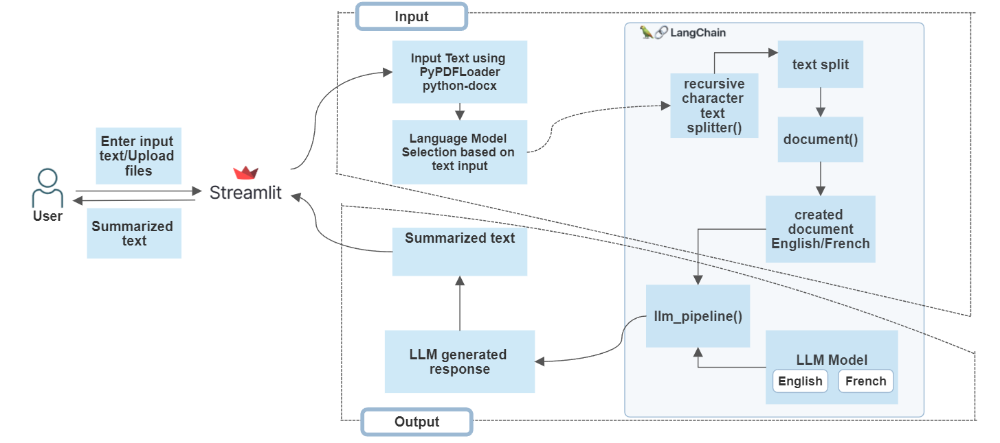

# Humber Summarizer - A Document Summarization Tool

The Humber Summarizer is a tool designed to summarize text, PDF, or Word documents. The tool is capable of performing English to English or French to French summarizations.

### Features
- Summarize plain-text, PDF, or Word documents.
- Choose between English or French language summarization.
- User-friendly interface powered by Streamlit.
- English model: [LaMini-Flan-T5-248M](https://huggingface.co/MBZUAI/LaMini-Flan-T5-248M)
- French model: [BARThez](https://huggingface.co/docs/transformers/model_doc/barthez)

### Project Flowchart



### Prerequisites
- Python (3.6 or higher)
- pip (Python package installer)

### Installation
1. Clone this repository to your local machine:
   
```
git clone https://github.com/tl-lay/document-summarizer.git
```

2. Install the required dependencies

```
pip install -r requirements.txt
```

### Usage
1. Run the main application file, `app.py`, using the following command:
```
streamlit run app.py
```
2. This will open a web browser window with the Document Summarizer interface.

3. Enter the text or upload a document you want to summarize.

4. Choose the appropriate language (English or French) for summarization.

5. Click the "Summarize" button to generate a concise summary of the input document.

The app should look something like this:


